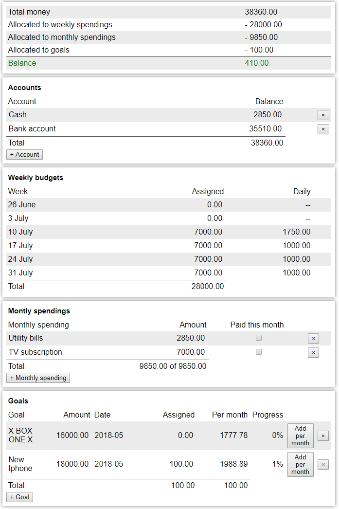

# Simple application for budget planning.

Enter how much money you have and distribute it between weekly, monthly spendings and goal allocation.

Know you know exactly (or not so exactly) how much money available for different purposes.

Next time just adjust the numbers. No expense tracking, receipt collecting or other bothersome stuff needed. No commitment. You can budget as often or rarely as you want.

## App uses Dropbox for storing data, so you will need dropbox account (no, this app won't be able to access your files).

# [App is here!](https://barskykd.github.io/budget/)

## Building app for yourself

1. Install node.js v7+
1. Download sources
1. Change const client_id in src/dropbox.ts to your api key
1. Run 'npm install && npm build'
1. Open 'public/index.html' in browser